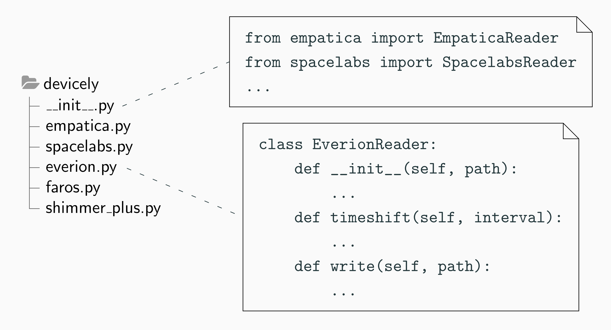

# Summary

Wearable devices can track a multitude of parameters such as heart rate, body
temperature, blood oxygen saturation, acceleration, blood glucose and much more
`[@Kamisalic2018:2018]`. Moreover, they are becoming increasingly popular with a steeping
increase in market presence in 2020 alone `[@IDC2020:2020]`. Applications for wearable
devices vary from tracking cardiovascular risks `[@Bayoumy2021:2021]` to identifying
COVID-19 onset `[@Mishra2020:2020]`. Therefore, there is a great need for scientists to
easily go through data acquired from different wearables.
In order to solve this problem and empower scientists working with biosignals,
we developed the **devicely** package. It represents the data in a science-friendly
format and lets scientists focus on what they want: the analysis of biosignals.

# Statement of need

Every wearable company has a different data format and reading this data is
usually a challenge for scientists. Therefore, in order for researchers to be able to use different sensor data in an easy and
friendly way we developed the **devicely** package. The package also contains two methods to help with data _deidentification_, one
is called timeshift and the other is a write method. The idea behind them is
that you can timeshift all your time series to a different time from the one the
actual experiments occurred and then write this new deidentified dataset back to
the original or a similar data format. This will empower scientists to keep patient privacy
and hopefully share more data to increase research reproducibility.

# Design

Different wearables come with different data formats which require different preprocessing steps.
However, it should be easy for scientists to add data from a new wearable to an existing pipeline and easy for developers to add a new wearable to the **devicely** package. We achieved both by encapsulating data preparation for each wearable behind three common methods: reading, timeshifting and writing data.

After reading, the data is accessible through the reader in common formats such as dataframes.
Deidentification is achieved by timeshifting the data, either by providing a shifting interval or randomly.
For writing back deidentified data we focused on keeping a format that can be read again using the same reader class.
In almost all cases, this is the same format as the one the wearable originaly provides.
This enables sharing data with the community while maintaining patient anonymity.

# Functionalities

All reader classes support three core functions: reading data created by a wearable, timeshifting them and writing them back.
To _read_ data, initialize the corresponding reader class, providing as a parameter a path to the data created by the wearable.
If you are unsure how each wearable outputs its data you can find examples in the _Examples_ section of our documentation website. 
After reading, you can access the data through the reader in convenient formats such as dictionaries and dataframes.

After creating a reader object you can call _timeshift_ on it. This assures deidentification by shifting all time-related data points.
If you would like to control the shifting interval, provide a parameter to _timeshift_.
If no parameter is provided, the data is shifted by a random time interval to the past.
You can write the timeshifted data back using the _write_ method.
For all wearables, the written data can be read again using the same reader class.

Feel free to add a new sensor class to the **devicely** package. As orientation you can use the package structure:

# Mention

This package was used in the following paper:

Morassi Sasso, A., Datta, S., Jeitler, M., Steckhan, N., Kessler, C. S.,
Michalsen, A., Arnrich, B., & Böttinger, E. (2020).
HYPE: Predicting Blood Pressure from Photoplethysmograms in a Hypertensive
Population. In M. Michalowski & R. Moskovitch (Eds.), Artificial Intelligence in
Medicine. AIME 2020. Lecture Notes in Computer Science, volume 12299 (pp.
325–335). Springer, Cham. https://doi.org/10.1007/978-3-030-59137-3_29

GitHub: https://github.com/arianesasso/aime-2020

Documentation: https://hpi-dhc.github.io/devicely

# Acknowledgements

We acknowledge contributions from Arpita Kappattanavar, Pascal Hecker, Bjarne Pfitzner and Lin
Zhou during the genesis and testing of this package.

# References
